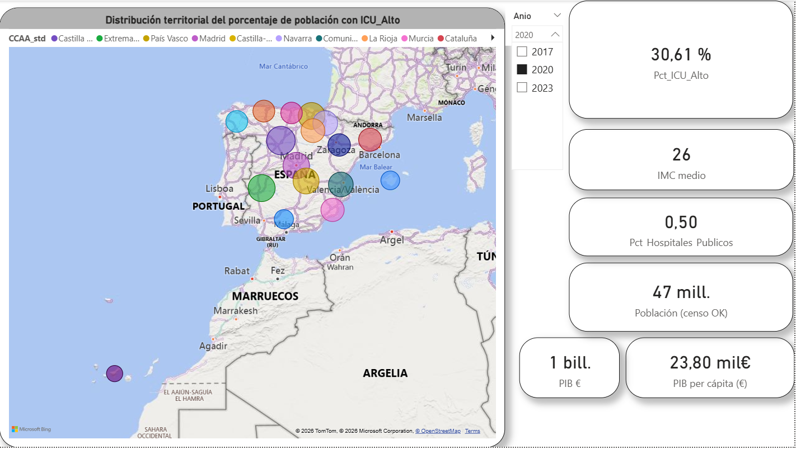
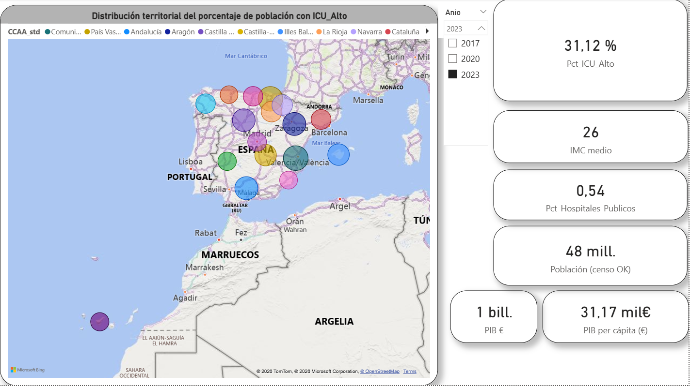

# Democratización del consumo de ultraprocesados en España (2017-2023)

Este proyecto analiza la evolución del estado nutricional y los hábitos alimentarios en España mediante el procesamiento de microdatos de la **Encuesta Nacional de Salud (ENSE)** y la **Encuesta Europea de Salud (EESE)**. La investigación se centra en la "democratización" del consumo de ultraprocesados y la persistencia de la cronicidad del sobrepeso a nivel territorial.

##  Hallazgos Principales (Power BI)

Basado en el análisis de correlación de Pearson y visualizaciones regionales:

*   **Cronicidad del IMC:** El Índice de Masa Corporal (IMC) medio nacional se ha mantenido estancado en **26** durante todo el sexenio (2017-2023).
*   | 2017 (35,27%) | 2020 (30,61%) | 2023 (31,12%) |
| :---: | :---: | :---: |
|  |  |  |
*   **Ruptura del Factor Renta:** La correlación entre el **PIB per cápita** y el consumo alto de ultraprocesados (**ICU_Alto**) ha caído drásticamente de **0,41 (2017)** a **0,16 (2023)** . Esto indica que la renta regional ya no protege contra una mala alimentación.
*   | Correlación 2017 (r=0,41) | Correlación 2023 (r=0,16) |
| :---: | :---: |
|  |  |
*   **Presión sobre el Sistema Público:** Se observa un aumento en la correlación entre las regiones con mayor consumo de ultraprocesados y el porcentaje de **hospitales públicos**, pasando de **0,16 a 0,36**.
*   | **2017 (r=0,16)** | **2020 (r=0,32)** | **2023 (r=0,36)** |
| :---: | :---: | :---: |
|  |  |  |
*   **Casos Regionales de Éxito y Alerta:**
*   **Murcia:** Logró una reducción significativa del ICU_Alto, especialmente en jóvenes (16-24 años), bajando del **72,62% al 42,05%**.
*   **Comunitat Valenciana:** Registró un incremento notable en su indicador de consumo de ultraprocesados, alcanzando el **43,4%** en 2023.
*   | Evolución Murcia | Evolución Valencia |
| :---: | :---: |
|  |  

##  Metodología Técnica

El proyecto utiliza un enfoque híbrido de ingeniería y análisis de datos:

1.  **Python (Limpieza y Extracción):** Procesamiento de archivos de ancho fijo (.txt y .tab) de los ciclos 2017, 2020 y 2023. Se extrajeron variables críticas de características físicas y frecuencia alimentaria.
2.  **Power BI (Analítica Avanzada):** 
    *   Cálculo del **IMC numérico** mediante DAX utilizando las variables de peso (**L1_128**) y altura (**L1_129**).
    *   Integración de datos externos del **INE** (PIB y Censo de población) para la normalización territorial.

##  Diccionario de Variables Clave

| Variable | Código Técnico | Descripción | Rango/Valores |
| :--- | :--- | :--- | :--- |
| **CCAA** | `CCAA` | Comunidad Autónoma de residencia | 01 - 18 |
| **Altura** | `L1_129` | Altura en cm (P.109 del cuestionario) | 040 - 220 cm |
| **Peso** | `L1_128` | Peso en kg (P.110 del cuestionario) | 025 - 180 kg |
| **Dulces** | `U120_11` | Frecuencia de consumo de dulces/bollería | 1 (Diario) - 6 (Nunca) |
| **Refrescos** | `U120_12` | Consumo de refrescos con azúcar | 1 (Diario) - 6 (Nunca) |
| **Comida Rápida** | `U120_13` | Consumo de pizzas, hamburguesas, etc. | 1 (Diario) - 6 (Nunca) |
| **Aperitivos** | `U120_14` | Consumo de snacks salados/patatas fritas | 1 (Diario) - 6 (Nunca) |

##  Estructura del Repositorio

*   `01_Informe/`: Documentación detallada y resumen ejecutivo.
*   `02_Visualizaciones/`: Archivo `.pbix` con los dashboards interactivos.
*   `03_Data/`: Microdatos procesados y tablas externas del INE.
*   `04_Scripts/`: Notebooks de Python para la ingeniería de variables.
*   `05_Documentacion/`: Diseños de registro originales de Sanidad.

---
**Autor:** Daniel Nuez Pons 
**Datos:** Ministerio de Sanidad / Instituto Nacional de Estadística (INE).

